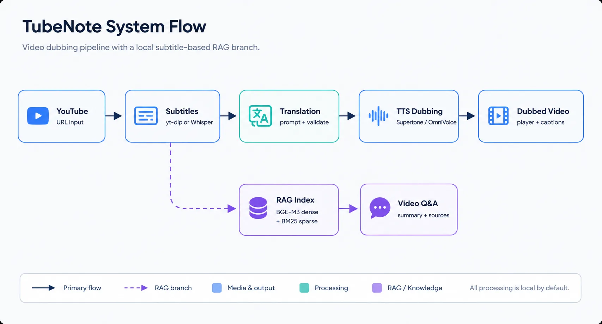
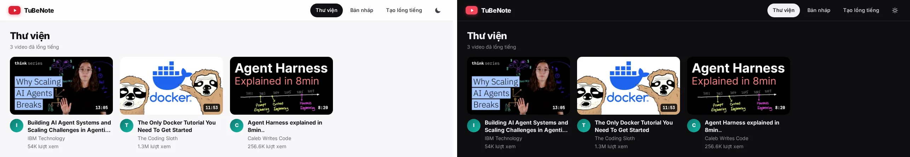
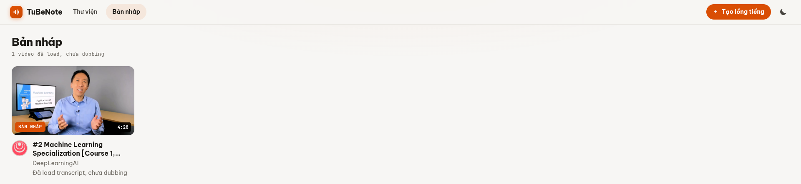
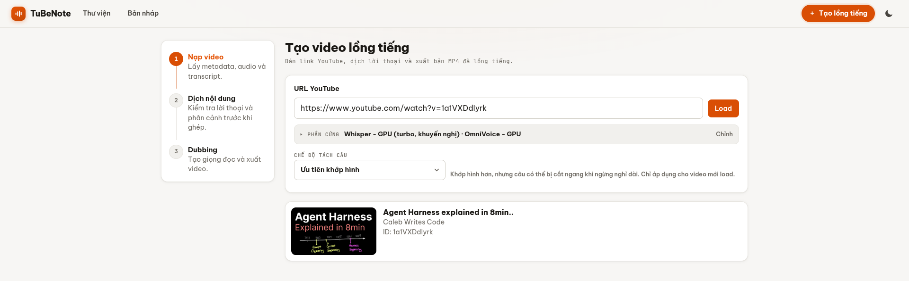
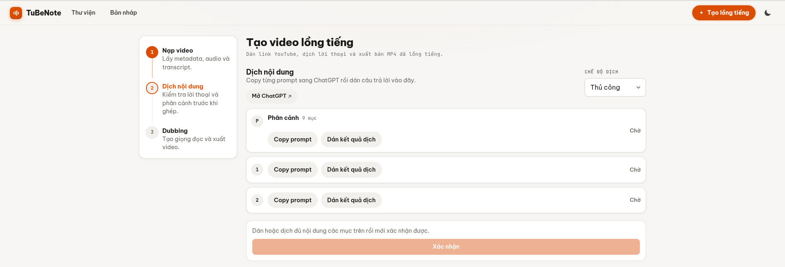
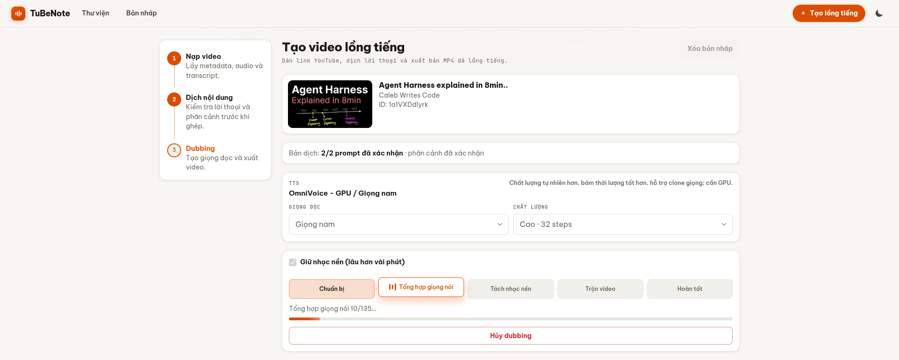
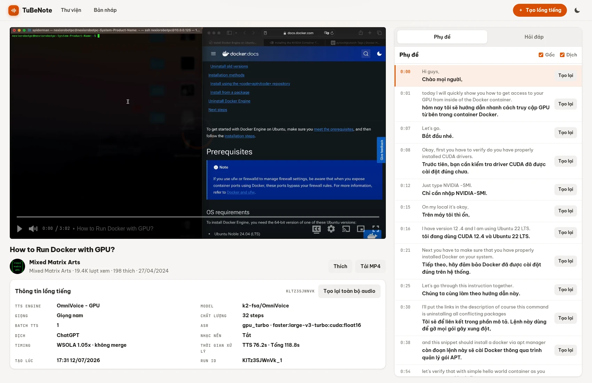

# TubeNote

[](https://www.youtube.com/watch?v=Y1PnEIHituE)
[](https://www.python.org/)
[](https://fastapi.tiangolo.com/)
[](https://nextjs.org/)
[](#prerequisites)
[](LICENSE)

**[English](README.md) | [Tiếng Việt](README.vi.md)**

TubeNote is a local-first AI video dubbing and video Q&A application. It turns an
**English** YouTube video into a **Vietnamese**-dubbed video (source and target
languages are fixed, not configurable), keeps editable subtitles and timing
metadata, and adds a RAG chat panel so users can ask questions about the video.

The project is built as a practical full-stack system around video localization:
subtitle acquisition, ASR fallback, duration-aware translation, TTS generation,
speech/subtitle alignment, background audio preservation, and hybrid retrieval
over processed transcripts.

**The entire pipeline runs on a CPU-only machine** (faster-whisper `small.en`
int8 + Supertonic TTS). An NVIDIA GPU is optional and unlocks the
higher-quality path: OmniVoice TTS with voice cloning and, with enough VRAM,
`large-v3-turbo` ASR (auto-picked over `medium.en` when available — faster and
more accurate at nearly the same VRAM cost, see `docs/dubbing.md`).



## Demo

| Video | Link |
| --- | --- |
| GUI walkthrough | [Watch on YouTube](https://www.youtube.com/watch?v=YOUR_GUI_DEMO_VIDEO_ID) |
| Dubbed output sample | [Watch on YouTube](https://www.youtube.com/watch?v=Y1PnEIHituE) |

<!-- GUI walkthrough is a placeholder link — replace YOUR_GUI_DEMO_VIDEO_ID
     once that video is recorded. -->

**Library:**



**Drafts: videos loaded but not dubbed yet:**



**Dubbing, step by step:**

1. Create Dubbing wizard — hardware auto-detection, TTS engine/voice/quality:

   

2. Translate content — copy prompts to ChatGPT (or translate via API) and validate batches before TTS:

   

3. Dubbing video - Choice voice and quality voice, Keep original background music (option):

     

**Video page — dubbed player, bilingual transcript, per-segment regeneration:**

   

## What TubeNote Does

1. Loads a YouTube video and metadata with `yt-dlp`.
2. Gets English subtitles from YouTube when available.
3. Falls back to faster-whisper ASR when subtitles are unavailable, re-splitting
   word-level timestamps into natural sentences (pauses, punctuation, word cap).
4. Generates duration-aware translation prompts from subtitle segments.
5. Lets the user translate manually, or translate batches through an LLM API.
6. Validates translated batches before TTS.
7. Generates Vietnamese speech with Supertonic CPU or OmniVoice GPU.
8. Aligns generated speech and Vietnamese subtitles to the video timeline.
9. Optionally separates and preserves background audio with Demucs.
10. Serves the final MP4 in a Vidstack player with subtitle controls.
11. Builds a hybrid RAG index over local subtitles for video Q&A.

## Highlights

- Local-first workflow: generated media, subtitles, Chroma indexes, summaries,
  logs, cookies, and voice samples stay outside git under ignored runtime paths.
- Hardware-aware setup: enter your machine's RAM/VRAM (auto-detected values
  pre-filled) and TubeNote picks the whole parameter set — Whisper model size,
  TTS engine, OmniVoice batch size, CPU thread counts — from calibratable tier
  tables in `config.yaml`; batch still halves itself on CUDA OOM instead of
  failing the job, and `scripts/measure_vram.py` measures real usage to tune
  the tables.
- Seven ASR presets (tiny.en → large-v3-turbo, CPU int8 and CUDA fp16) through
  faster-whisper/CTranslate2, with word-timestamp-based sentence re-splitting
  for TTS-friendly segment boundaries.
- Two translation modes:
  - Manual: copy prompts to ChatGPT and paste validated results back.
  - API: choose provider/model and translate batches directly from TubeNote.
- Two TTS engines:
  - Supertonic CPU: fast default path, fitted to timing slots after generation.
  - OmniVoice GPU: higher quality path with duration-conditioned generation and
    voice reference support.
- Per-segment regeneration after dubbing, including pronunciation mapping.
- Vietnamese subtitles are aligned to generated TTS timing, not only raw source
  subtitles.
- Optional Demucs background preservation for videos with music or ambience.
- Hybrid RAG: Chroma dense retrieval with `BAAI/bge-m3`, BM25 sparse retrieval,
  and Reciprocal Rank Fusion.
- RAG chat starts by creating/loading one cached video summary, then uses the
  selected LLM provider/model for the chat session.

## Tech Stack

| Area | Stack |
| --- | --- |
| Frontend | Next.js 14, React, Vidstack, react-markdown |
| Backend | FastAPI, Python 3.11 |
| Video ingest | `yt-dlp`, YouTube subtitles |
| ASR | faster-whisper, CTranslate2 |
| Translation | Prompt workflow plus DeepSeek/OpenAI/Gemini/Anthropic via LangChain |
| TTS | Supertonic, OmniVoice |
| Audio/video | ffmpeg, imageio-ffmpeg, SoundFile, Demucs, torch/torchaudio |
| RAG | LangChain, Chroma, `BAAI/bge-m3`, BM25, RRF |
| Runtime jobs | FastAPI background tasks with in-memory job status |

## Repository Layout

```text
backend/
  api/                 FastAPI routers for dubbing, video, and RAG
  llm/providers/       Provider adapters for DeepSeek, OpenAI, Google, Anthropic
  pipeline/            High-level dubbing and Q&A orchestration
  services/
    dubbing/           TTS validation, timing fit, background separation, logs
    rag/               Chunking, embedding, Chroma store, summary cache
    video/             WebVTT and timing helpers
    youtube/           yt-dlp metadata/subtitle fetch and Whisper fallback
    hardware.py        RAM/VRAM detection and hardware profile recommendation
  workers/             Lightweight background job registry
  tests/               Unit tests (unittest, no GPU/model downloads needed)

frontend/
  app/                 Next.js app routes: library, drafts, add, video detail
  components/          Vidstack player and transcript UI
  lib/api.js           Frontend API client through Next rewrites

docs/
  architecture.md      System boundaries and data flow
  dubbing.md           Dubbing pipeline details
  rag.md               RAG indexing and Q&A details

scripts/
  measure_vram.py      Measure real VRAM/RAM usage to calibrate hardware tiers
```

## Documentation

Implementation details live in `docs/`:

- [Architecture](docs/architecture.md)
- [Dubbing Pipeline](docs/dubbing.md)
- [RAG Pipeline](docs/rag.md)

The README is intentionally kept as the project entry point. Detailed design
notes and pipeline behavior are documented in the files above.

## Prerequisites

- NVIDIA GPU is recommended for OmniVoice and faster Whisper GPU mode.
  OmniVoice needs **≥ 3GB VRAM** (measured minimum ~2.5GB, +buffer for
  driver/CUDA context overhead); below that it falls back to Supertonic CPU.
- CPU-only machines can run the default Supertonic + Whisper CPU path, but ASR
  and TTS will be slower.
- Runs via Docker Compose — see "Setup & Run (Docker)" below. Requires
  [Docker Engine](https://docs.docker.com/engine/install/) with the Compose
  plugin (Docker Desktop on Windows/macOS).

## YouTube Cookies

Cookies are optional. Most public videos load fine without them. Add cookies
when you hit one of these:

- Age-restricted, private, or members-only videos.
- YouTube's bot-detection blocking metadata/subtitle/audio requests for your
  IP (uncommon for normal usage, more likely with heavy/repeated requests).

**In this Docker setup, cookies must be a file** — the app also supports
auto-detecting cookies from a locally installed browser
(`YT_COOKIES_BROWSER=chrome`), but that only works when the app runs directly
on your machine with a real browser present. A container has no browser, so
`YT_COOKIES_BROWSER` is explicitly disabled in `docker-compose.yml` and does
nothing here — use the file export below instead.

```text
YT_COOKIES_DIR=cookies
# or
YT_COOKIES_PATH=cookies/primary.txt
```

To create a cookies file:

1. Install a browser extension that exports cookies in Netscape `cookies.txt`
   format, for example "Get cookies.txt LOCALLY".
2. Log in to YouTube in that browser.
3. Export cookies for `youtube.com`.
4. Save the file as `cookies/primary.txt`.

The `cookies/` directory is ignored by git. Do not commit exported cookies.
This file is a login credential — treat it like a password: exported cookies
can degrade or get revoked if used in unusual, high-frequency automated
patterns, so avoid scripting rapid repeated requests against it.

## Optional Web Search

Video-local RAG works without web search. The Docker stack (below) starts
SearXNG for you automatically as part of the full stack; override the URL if
you point the app at a different instance:

```text
SEARXNG_URL=http://localhost:8888
```

## Setup & Run (Docker)

Requires [Docker Engine](https://docs.docker.com/engine/install/) with the
Compose plugin (Docker Desktop on Windows/macOS). No local Python, Node.js, or
`ffmpeg` install needed — everything runs inside the containers.

### Environment

```bash
cp .env.example .env
```

**API keys are optional and depend on which features you use:**

- Dubbing with **Manual translation mode** (copy prompts to ChatGPT, paste
  results back): no API key needed at all.
- **API translation mode**: needs one LLM provider key (DeepSeek/OpenAI/
  Gemini/Anthropic).
- **RAG Q&A chat**: retrieval and embeddings run locally for free, but answers
  and the cached summary are generated by an LLM, so this also needs one
  provider key.

Fill only the providers/features you use. Current defaults:

- Translation API UI defaults to DeepSeek Flash when API mode is selected.
- RAG UI defaults to DeepSeek unless changed in `backend/config.yaml`.
- TTS defaults to Supertonic CPU.
- ASR defaults to the CPU preset in `backend/config.yaml`.

Minimal API setup for DeepSeek:

```text
DEEPSEEK_API_KEY=...
```

Optional alternative providers:

```text
OPENAI_API_KEY=...
GOOGLE_API_KEY=...
ANTHROPIC_API_KEY=...
```

### Run

The whole stack (backend + frontend + SearXNG) can run in containers:

```bash
docker compose up -d --build
```

- Frontend: `http://localhost:3000` — Backend: `http://localhost:8010` (loopback only).
- The default image is **CPU-only** (CPU build of PyTorch, much smaller than
  the CUDA one). ASR runs `small.en` int8 and TTS uses Supertonic.
- `./data` and `./cookies` are bind-mounted onto the host, so generated media
  and subtitles are easy to inspect outside the container. Model downloads
  (Whisper, bge-m3, TTS) are cached in the `model-cache` volume and survive
  image rebuilds.
- First run downloads several GB of models on demand — later runs are fast.

**GPU (NVIDIA)** — enables CUDA Whisper presets and OmniVoice.

- **Linux**: requires the
  [NVIDIA Container Toolkit](https://docs.nvidia.com/datacenter/cloud-native/container-toolkit/latest/install-guide.html)
  installed on the host first (a driver alone is not enough — this is what
  lets the container see the GPU at all).
- **Windows**: use Docker Desktop with the WSL2 backend + an up-to-date
  NVIDIA driver — follow
  [NVIDIA's WSL2 CUDA guide](https://docs.nvidia.com/cuda/wsl-user-guide/index.html)
  instead of the toolkit install above.

```bash
docker compose -f docker-compose.yml -f docker-compose.gpu.yml up -d --build
```

Verified end-to-end on an RTX 4050 Laptop GPU (Fedora host): container
correctly detects the GPU, `/api/hardware` recommends `gpu_turbo` + OmniVoice,
image is ~14GB (vs ~5.4GB CPU-only).

Notes:

- Cookies: see "YouTube Cookies" above — the `cookies/` folder is mounted into
  the container either way.
- On SELinux hosts (Fedora), the compose file already uses `:z` on bind
  mounts. Files created by the container in `./data` end up owned by root on
  the host — run `sudo chown -R $USER data` if you need to edit them directly.
- CPU and GPU builds use separate image tags (`tubenote-backend:cpu` and
  `tubenote-backend:gpu`), so building one does not overwrite the other — both
  can be built and kept around, switch between them by picking the matching
  `docker compose` command.

## Typical Workflow

1. Open `Tạo lồng tiếng`.
2. Choose ASR model. CPU is the default compatibility path.
3. Load a YouTube URL.
4. Choose TTS engine in the TTS panel.
5. Choose translation mode:
   - Manual: copy prompts, translate externally, paste back.
   - API: choose provider/model and let TubeNote translate batches.
6. Validate translated batches.
7. Optionally adjust voice, quality, and background preservation.
8. Start dubbing.
9. Review the output in the player.
10. Regenerate individual segments when pronunciation or delivery needs fixing.
11. Use the Q&A tab to generate/load a summary and ask questions over the video.

## Runtime Data

Generated files are ignored by git:

- `data/` (including runtime voice references in `data/voice_clones/`)
- `cookies/`
- `.env`

`voice_clones/` at the repository root is committed on purpose: it contains the
built-in voice preset references for the two TTS engines, which the voice
dropdown depends on.

Important runtime paths:

```text
data/metadata/          YouTube metadata JSON
data/sub_raw/           Raw subtitles from YouTube or Whisper
data/sub_vi_super/      Supertonic translated subtitle/timing JSON
data/sub_vi_omni/       OmniVoice translated subtitle/timing JSON
data/audio_dub/         Generated dubbed speech
data/video_dub/         Final MP4 outputs
data/chroma/            RAG vector stores
data/rag_summary/       Cached video summaries
data/logs/              CSV timing/performance logs
data/voice_clones/      Runtime voice references generated from source videos
```

## Project Limitations

- Runtime jobs are stored in memory. A backend restart loses active job status.
- Local browser draft state is used during dubbing, not a multi-user database.
- TTS quality depends on subtitle timing, translation length, model behavior,
  and segment duration.
- Background preservation is source-dependent; music-heavy videos usually work
  better than noisy speech with overlapping vocals.
- Generated media and downloaded YouTube content are intentionally excluded from
  the public repository.

## License

MIT.
