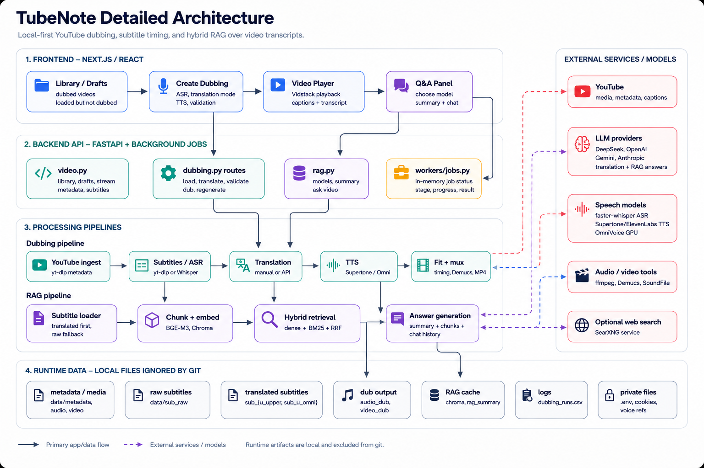

# Architecture

TubeNote is a local-first full-stack app. The frontend is a Next.js interface
for library, draft, dubbing, video playback, transcript editing, segment
regeneration, and RAG chat. The backend is a FastAPI service that owns YouTube
ingestion, subtitle/ASR, translation validation, TTS generation, video muxing,
and retrieval.

## Detailed Diagram



## High-Level Flow

```text
YouTube URL
  -> backend loads metadata, media, and subtitles
  -> subtitle JSON is stored under data/subtitles
  -> frontend receives batched translation prompts
  -> user translates manually or through API mode
  -> backend validates translated batches
  -> selected TTS engine generates Vietnamese speech
  -> backend aligns speech/subtitles to the video timeline
  -> final MP4 is stored under data/video_dub
  -> frontend player serves video, subtitles, transcript, regeneration, and RAG
```

## Runtime Boundaries

```text
frontend/
  app/page.jsx              Library of dubbed videos
  app/drafts/page.jsx       Loaded videos that are not dubbed yet
  app/add/page.jsx          Load, translate, validate, and dub workflow
  app/video/[id]/page.jsx   Player, transcript, regeneration, and RAG panel
  components/VideoPlayer    Vidstack player and subtitle controls
  components/Transcript     Timestamped transcript view
  lib/api.js                Browser API client through Next.js rewrites

backend/
  main.py                   FastAPI app entrypoint
  api/video.py              Library, draft, metadata, stream, subtitle routes
  api/dubbing.py            Load, validate, translate API, TTS model, dub routes
  api/rag.py                RAG model, summary, and ask routes
  pipeline/dubbing.py       Dubbing orchestration
  pipeline/qa.py            Retrieval + answer orchestration
  workers/jobs.py           In-memory job registry for long-running tasks
```

## Frontend Responsibilities

The frontend keeps the user workflow ergonomic, but does not perform heavy
processing:

- Shows library and draft videos.
- Starts long-running backend jobs and polls job status.
- Stores an in-progress dubbing draft in browser localStorage.
- Lets the user choose ASR preset, TTS engine, voice, quality, translation mode,
  and background preservation.
- Displays validation errors at the batch/segment level before dubbing.
- Plays final video through Vidstack with selectable subtitles.
- Sends per-segment regeneration requests.
- Starts a RAG session by generating/loading the video summary, then sends
  questions with short chat history.

## Backend Responsibilities

The backend owns all expensive or file-producing work:

- YouTube metadata, video, audio, and subtitle acquisition.
- faster-whisper fallback when subtitles are not available.
- Translation prompt generation and translation API calls.
- Translation result parsing and TTS text normalization.
- TTS synthesis through Supertonic or OmniVoice.
- Audio fitting, padding, time compression, and muxing.
- Demucs background separation and final mixing.
- Subtitle JSON and WebVTT generation.
- RAG chunking, embedding, Chroma indexing, BM25 retrieval, summary cache, and
  LLM answer generation.

## API Surface

Core routes:

```text
GET  /api/library
GET  /api/drafts
GET  /api/video/{id}/meta
GET  /api/video/{id}/transcript
GET  /api/video/{id}/subtitles/{lang}
GET  /api/stream/{id}

POST /api/load
GET  /api/load/{job_id}
POST /api/validate
GET  /api/translation/models
POST /api/translate
GET  /api/translate/{job_id}
GET  /api/tts/models
POST /api/dub
GET  /api/dub/{job_id}
POST /api/video/{id}/segments/{index}/regenerate
GET  /api/regenerate/{job_id}

GET  /api/rag/models
GET  /api/rag/video/{id}/summary
POST /api/rag/video/{id}/ask
```

Long-running endpoints return a `job_id`. The frontend polls the corresponding
status route until `status` becomes `done` or `error`.

## Configuration

`backend/config.yaml` stores non-secret defaults:

- LLM provider/model lists.
- RAG thresholds and embedding model.
- Whisper ASR presets.
- Subtitle style.
- Translation batch size.
- TTS model/voice lists and OmniVoice budget policy.
- Data path locations.

`.env` stores secrets and machine-specific overrides:

- Provider API keys.
- YouTube cookies.
- backend/frontend ports.
- embedding overrides.
- TTS model overrides.

## Data Model

TubeNote uses JSON files as the local runtime database. A typical segment moves
through these stages:

```json
{
  "text": "Original English subtitle",
  "start": 12.4,
  "duration": 4.2,
  "text_vi": "Vietnamese display text",
  "text_tts": "Text sent to TTS",
  "tts": {
    "engine": "supertonic",
    "num_step": 8
  },
  "tts_start": 12.4,
  "tts_end": 16.1
}
```

Not every field exists at every stage. Raw subtitle files contain source text
and timestamps. Translated subtitle files add Vietnamese text, TTS metadata, and
speech timing fields.

## Runtime Storage

Runtime artifacts are ignored by git:

```text
data/metadata/       YouTube metadata
data/audio/          Downloaded/extracted source audio
data/video/          Downloaded source video
data/subtitles/      Subtitle JSON, raw after load and enriched after dubbing
data/audio_dub/      Generated dubbed speech
data/video_dub/      Final MP4 files
data/chroma/         Chroma vector stores
data/rag_summary/    Cached video summaries
data/logs/           CSV timing/performance logs
data/voice_clones/   Runtime source-video voice references
```

This keeps the repository safe to publish: no cookies, API keys, generated
media, copyrighted videos, vector indexes, or personal voice samples are
committed.

## Background Jobs

`backend/workers/jobs.py` is intentionally simple. It stores job state in a
process-local dictionary:

```text
job_id -> status, stage, progress, error, result
```

This is sufficient for a single-user local app. For a hosted multi-user
deployment, replace it with Redis/Celery/RQ or another persistent job queue.

## Player and Subtitle Serving

The player loads:

- MP4 stream from `/api/stream/{id}`.
- Vietnamese WebVTT from `/api/video/{id}/subtitles/vi`.
- English WebVTT from `/api/video/{id}/subtitles/en`.

Vietnamese subtitle timing prefers generated TTS timing when available. This is
important because TTS output can be shorter or longer than the source subtitle
slot.

## Local-First Tradeoffs

TubeNote is optimized for personal local workflows:

- Fast iteration and direct file inspection.
- No hosted database requirement.
- Easy deletion of generated data by removing `data/`.
- Lower privacy risk because media, cookies, and voice references stay local.

The tradeoff is that active job state and localStorage drafts are not designed
for multiple users or stateless cloud scaling.
