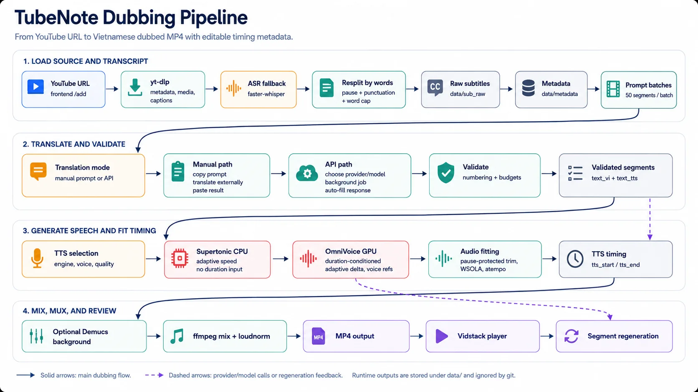
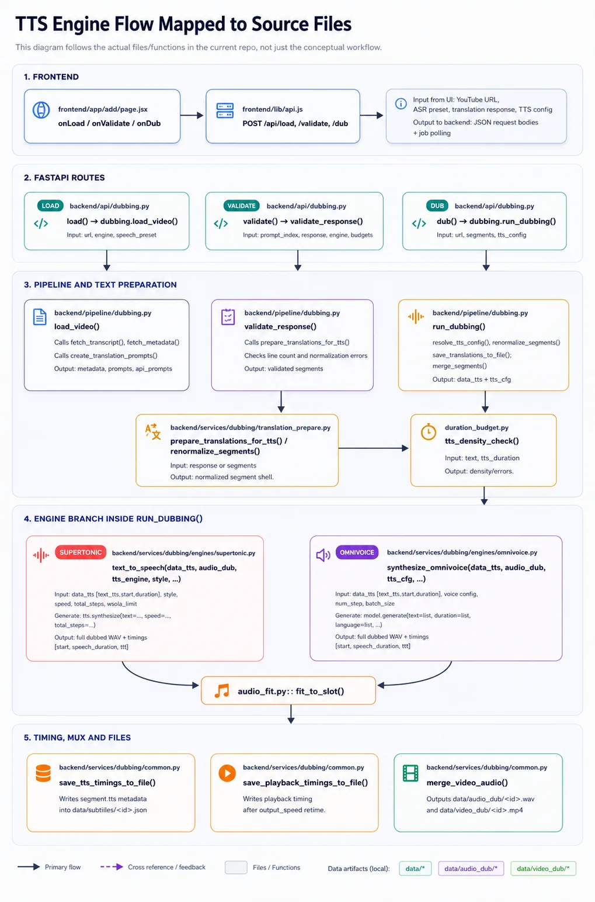

# Dubbing Pipeline

This document describes the TubeNote dubbing workflow from a YouTube URL to a
Vietnamese dubbed MP4.

## Goals

TubeNote optimizes for controllable video localization rather than one-click
black-box dubbing:

- Keep original subtitle timestamps inspectable.
- Let users control translation mode, TTS engine, voice, and quality.
- Validate translated batches before expensive TTS generation.
- Preserve timing metadata so subtitles can follow generated speech.
- Allow regeneration of individual segments after full-video dubbing.

## Pipeline Diagram



For a code-level view that maps each stage to the actual files and functions:



## Stage 1: Load Video

The frontend calls:

```text
POST /api/load
GET  /api/load/{job_id}
```

The backend:

```text
extract video id
-> check whether dubbed output already exists
-> fetch or reuse transcript
-> fetch metadata
-> create run log row
-> build translation prompts
-> return metadata + prompts
```

If the video already has `data/video_dub/{video_id}.mp4`, the API returns
`already_dubbed: true` and the frontend redirects to the player page.

## Stage 2: Subtitle Acquisition

Subtitle source priority:

```text
1. yt-dlp subtitles / automatic captions
2. faster-whisper fallback
```

Subtitles are stored as timestamped JSON under `data/subtitles/`. After
dubbing, the same file is enriched with Vietnamese text and TTS timing:

```json
{
  "text": "Let's look at the function f of x.",
  "start": 12.4,
  "duration": 4.2
}
```

YouTube subtitles are used as-is. Whisper output, however, is **re-split from
word-level timestamps** (`word_timestamps=True` in faster-whisper) instead of
trusting Whisper's own segment boundaries, which are not anchored to real
pauses and often glue two spoken sentences together or leak silence into the
edges. All words are flattened into one timeline, then rebuilt into sentences
using three signals (`backend/services/youtube/transcript_whisper.py`):

```text
1. pause: gap between two words >= sentence_pause_alpha (default 0.02s)
2. punctuation: previous word ends a sentence (. ! ? …)
3. length trigger: runs longer than sentence_max_words are soft-split at the
   most balanced comma — or, failing that, right BEFORE a conjunction
   (and/but/because/...) so it starts the second half. There is no hard
   word-count cut: a run with no natural cut point stays whole, because a
   long-but-complete sentence translates and reads better than two clipped
   fragments (0 disables this tier entirely)
```

Fragments shorter than `sentence_min_words` are merged into the closer
neighbor, and segment start/end are tightened to the first/last real word.
All three knobs live in `backend/config.yaml` under `whisper:`. If word
timestamps are unavailable for a segment (alignment failure, or
`word_timestamps: false` in the preset), that segment falls back to Whisper's
raw boundaries — speech is never dropped.

## Hardware-Aware Setup

The create screen asks for the machine's **RAM and VRAM** (two number inputs)
instead of exposing raw ASR/TTS knobs up front. Auto-detection only pre-fills
the inputs — this is a local open-source tool, so users can correct or
override the values, and the numbers they enter are persisted in
`localStorage` (outliving drafts).

```text
GET /api/hardware                     detected RAM/VRAM/cores + recommendation
GET /api/hardware/recommend?ram_gb=&vram_gb=   recommendation for manual values
```

`backend/services/hardware.py::recommend_setup` maps (RAM, VRAM, cores) to a
full parameter set using tier tables in `backend/config.yaml` (section
`hardware`) — recalibrate by editing the yaml, no code changes:

```text
asr_gpu_by_vram    VRAM >= 1.0GB -> gpu_small (small.en fp16, ~0.71GB measured)
                   VRAM >= 2.5GB -> gpu (medium.en fp16, ~1.96GB measured)
                   VRAM >= 3.0GB -> gpu_turbo (large-v3-turbo fp16, ~2.3GB
                                    measured, faster AND better quality than
                                    gpu at nearly the same VRAM cost)
asr_cpu_by_ram     RAM < 3GB -> cpu_tiny, 3-5GB -> cpu_base, >= 5GB -> cpu
                   (CPU is speed-bound, not RAM-bound, so the auto pick caps
                   at small.en; cpu_medium exists but is advanced-only)
omnivoice_min_vram_gb   VRAM >= 3.0GB -> OmniVoice, else Supertonic
omnivoice_batch_by_vram batch 1 at every measured tier — batching didn't show
                        a real speed benefit (GPU already saturated at batch=1)
max_auto_threads   whisper cpu_threads / supertonic intra_op threads = cores,
                   clamped to this cap (0 in presets/config = auto)
```

Whisper `batch_size`/`progressive` in each preset: `progressive: false` would
route through faster-whisper's `BatchedInferencePipeline` for real batched
inference, but real measurement (`scripts/measure_vram.py --whisper-sweep` on
2 real audio files) found its internal VAD chunking **silently drops spoken
content** in some time windows (up to 30-67% of words missing in a 50s window
on one test audio) — not just different segmentation. All presets keep
`progressive: true` (no real batching) until this is fixed upstream or a safer
sweep methodology is found; `batch_size` in the yaml is currently inert.

Changing RAM/VRAM re-applies the recommendation (ASR preset, TTS engine, and
an OmniVoice `batch_size` carried in the dub payload so a manually entered
VRAM wins over the detected one). Manual tweaks in the advanced ASR select or
the TTS panel stick until the hardware inputs change again. The CUDA
OOM-halving fallback in `synthesize_omnivoice` remains the runtime safety net.

To calibrate the tables with real measurements on your machine:

```bash
python scripts/measure_vram.py --omnivoice --batch 4 --num-step 32
python scripts/measure_vram.py --whisper gpu --audio data/audio/<id>.mp3
python scripts/measure_vram.py --whisper-sweep --models small.en,medium.en,large-v3-turbo \
  --batches 1,4,8,16 --device cuda --audio data/audio/<id>.mp3
```

## ASR Presets

The app exposes ASR presets from `backend/config.yaml`.

Current defaults:

```text
CPU preset:
  engine: faster-whisper
  model: small.en
  device: cpu
  compute_type: int8

GPU preset (default "gpu"):
  engine: faster-whisper
  model: medium.en
  device: cuda
  compute_type: float16

GPU preset (best, auto-picked when VRAM >= 3.0GB, "gpu_turbo"):
  engine: faster-whisper
  model: large-v3-turbo
  device: cuda
  compute_type: float16
```

CPU is the default compatibility path. GPU is optional and requires CUDA runtime
libraries for CTranslate2.

After Whisper finishes, the code attempts to free GPU memory before later TTS
steps.

## Stage 3: Translation Prompts

Translation prompts are generated from raw subtitle segments in batches. The
default batch size is 50 segments.

Each input line includes:

```text
<index>. [≤N tiếng] <source English text>
```

`N` is a Vietnamese syllable/word budget derived from segment duration. For
OmniVoice, the frontend adapts the displayed marker into a range such as
`[A-B tiếng]` because OmniVoice receives duration information and can tolerate a
more natural translation as long as it remains reasonable for the slot.

The prompt asks the LLM to:

- Return exactly one output line per input line.
- Keep the same numbering and order.
- Avoid extra notes, Markdown, or code blocks.
- Produce natural Vietnamese for spoken dubbing.
- Keep names, acronyms, model names, numbers, and technical terms stable.
- Stay within the duration-aware budget.

## Translation Modes

The frontend has two modes.

### Manual Mode

Manual mode is intended for high-control translation:

```text
copy prompt
-> translate in ChatGPT or another external UI
-> paste response into TubeNote
-> validate response
```

This mode shows prompt copy buttons and an external ChatGPT launcher.

### API Mode

API mode translates directly from TubeNote:

```text
choose provider/model
-> translate one batch or all batches
-> auto-fill response
-> auto-validate batch
```

API mode hides manual prompt controls. The current UI defaults to DeepSeek Flash
when API mode is selected. Provider/model lists come from `backend/config.yaml`
through:

```text
GET /api/translation/models
```

Each batch is translated as a background job:

```text
POST /api/translate
GET  /api/translate/{job_id}
```

### API Batch Size and Retry

API mode uses smaller batches than manual mode:

```text
manual_batch_size = 50
api_batch_size = 25
api_max_chars_per_batch = 4000
api_min_batch_size = 5
api_concurrency = 8
api_job_timeout_sec = 300
```

The smaller API default is intentional. Some chat models can still drop or merge
numbered lines even when the prompt is clear. If validation detects a
missing/extra-line error, the frontend automatically splits that API batch into
smaller retry batches, translates them again, then merges the validated segments
back into the original batch order.

API prompts are translated with a bounded concurrency pool instead of one by
one. The default concurrency is 8 requests at a time, which is faster for
DeepSeek-style APIs while still avoiding an unbounded burst.

Each original API prompt also has a timeout budget. The default is 300 seconds,
including split/retry attempts. If a provider job is stuck, that prompt is
marked as failed and other prompts can continue.

The retry split stops when the batch reaches the minimum size or the retry depth
limit. If it still fails, the UI shows the batch error so the user can fix it
manually.

## Stage 4: Validation

The frontend calls:

```text
POST /api/validate
```

The backend parses the translated response and checks:

- Batch marker exists.
- Numbered output lines can be parsed.
- Output count matches expected line count.
- Engine-specific length rules are satisfied.
- TTS text can be prepared.

Validated segments contain:

```json
{
  "vi": "Vietnamese display text",
  "tts": "Vietnamese text sent to TTS",
  "normalization": {
    "errors": [],
    "warnings": []
  }
}
```

The UI shows both display text and TTS text so users can see what will actually
be synthesized.

## TTS Text Normalization

TubeNote keeps subtitle display text clean in `text_vi`, then builds a separate
`text_tts` string for speech synthesis.

Important cases:

- User pronunciation mapping can override difficult terms during segment
  regeneration.
- Acronyms and technical terms are kept in display text.
- `text_tts` can differ from `text_vi` when pronunciation overrides are applied.

The guiding rule is: display subtitles should stay clean, while TTS text can be
adjusted when speech quality requires it.

## Stage 5: TTS Engine Selection

TTS is selected in the TTS panel after loading a video.

Both engines receive the same validated segment shape:

```json
{
  "text": "Original source text",
  "start": 12.4,
  "duration": 4.2,
  "text_vi": "Vietnamese subtitle text",
  "text_tts": "Vietnamese text sent to TTS"
}
```

The difference is only the TTS engine behavior:

| Item | Supertonic - CPU | OmniVoice - GPU |
| --- | --- | --- |
| Runtime | CPU-oriented local TTS | GPU-oriented higher-quality TTS |
| TTS input | `text_tts` from `data/subtitles/{video_id}.json` | `text_tts` from `data/subtitles/{video_id}.json` |
| Duration request | Not supported by the model call | `duration = source duration + adaptive delta` |
| Voice options | "Giọng nam", "Giọng nữ" | "Giọng nam", "Giọng nữ", or source-video voice clone |
| Batch generation | One segment at a time | Batched generation; batch size auto-picked from VRAM (`hardware.omnivoice_batch_by_vram`), halved and retried on CUDA OOM |
| Default quality | 8 steps | 32 steps |

Both engines adapt to how much a translated segment actually overflows its
slot, instead of using one fixed value for every segment:

- Supertonic (`engines/supertonic.py::adaptive_speed`): synthesis `speed`
  stays at `1.0` when the text comfortably fits the slot. Only segments that
  genuinely overflow get a higher speed, scaled by how much they overflow.
- OmniVoice (`engines/omnivoice.py::_generation_slot_seconds`): the extra
  duration passed to `generate()` is no longer a flat `+3s` for every segment.
  It is computed from the segment's real text length
  (`duration_budget.natural_duration_seconds`) minus the slot, so short
  segments are not handed several idle seconds they would otherwise fill by
  speaking slowly and pausing (which then required heavy silence trimming to
  fit back into the slot).

Both formulas apply a small safety multiplier (`alpha`, default `1.2`) on top
of the calculated overflow: they intentionally ask for slightly less
correction than the exact math implies, and let the WSOLA/atempo step in
"Audio Fitting" absorb the remainder. This is safe because trimming excess
silence afterward is lossless, while asking an engine to over-correct upfront
risks rushed or truncated speech.

Quality options exposed in the UI:

```text
Supertonic:
5 steps   fast / lower quality
8 steps   balanced default
12 steps  higher quality

OmniVoice:
16 steps  fast
24 steps  balanced
32 steps  high
48 steps  maximum
```

## Stage 6: Audio Fitting and Timing

TubeNote keeps the source subtitle `start` as the anchor. For each segment, the
target slot is based on:

```text
segment start -> next segment start
```

or, for the final segment:

```text
segment start -> segment start + duration
```

### Supertonic Fitting

Supertonic does not generate directly to a duration. TubeNote fits the generated
audio into the source slot after synthesis:

```text
trim silence
-> WSOLA light compression, up to 1.05x
-> ffmpeg atempo
-> final pad/fit to target slot
```

If generated speech is shorter than the slot, silence is padded at the end.

### OmniVoice Fitting

OmniVoice receives target duration information before synthesis. TubeNote still
fits the generated audio into the same source slot after synthesis:

```text
trim silence
-> WSOLA light compression, up to 1.05x
-> ffmpeg atempo
-> final pad/fit to target slot
```

The fitter records `tts.fit` metadata and warnings when a segment had to be
compressed heavily.

### Silence Trimming Is Not Uniform

`fit_by_silence` (used by both engines) does not shorten every silent gap by
the same proportion. It ranks the detected gaps by length and protects the
longest ~30% with a higher floor (they are more likely to be a sentence/comma
pause that carries natural rhythm), while short gaps — more likely a stray
micro-gap the model produced between two words — are trimmed down to a lower
floor first. This runs before WSOLA/atempo, so it removes time without
changing tempo whenever possible.

## Stage 7: Background Audio

When background preservation is enabled, TubeNote uses Demucs:

```text
original audio
  -> vocals
  -> no-vocals background
```

The no-vocals background stem is cached and mixed with dubbed speech during
final video muxing.

This works best when the original video has music or ambience behind speech. It
is less reliable when vocals and background are heavily overlapping.

### Final Mix Loudness

`merge_video_audio` mixes the dub track and the background/original track with
ffmpeg `amix`, explicitly passing `normalize=0` — ffmpeg's default would
otherwise auto-halve the combined amplitude, making the dub quieter than
intended regardless of the configured volume levels. The combined track then
goes through `loudnorm` (EBU R128, target `-16 LUFS`) so the final perceived
loudness is consistent across videos, instead of relying on a per-sample
peak-clip that only ever lowers volume and never raises a track that came out
too quiet.

## Stage 8: Output Files

Final and intermediate files are stored under `data/`:

```text
data/video_dub/{video_id}.mp4
data/audio_dub/{video_id}.wav
data/subtitles/{video_id}.json
```

The subtitle JSON stores TTS timing metadata after dubbing. Vietnamese WebVTT
subtitles are built from this JSON when the player requests them.

## Segment Regeneration

After dubbing, the video page can regenerate one segment:

```text
load stored segment
-> edit Vietnamese text
-> add pronunciation mapping if needed
-> regenerate speech for the segment
-> replace the audio slot
-> remux video
-> update subtitle timing metadata
```

Both Supertonic and OmniVoice support segment regeneration. Regeneration uses the
engine stored in that segment's metadata.

## Pronunciation Mapping

Segment regeneration supports user-defined source/spoken pairs:

```text
RAG -> rác
W   -> đúp liu
```

The display subtitle remains the edited Vietnamese text. The spoken replacement
only affects the TTS input.

## Drafts and Library

TubeNote separates incomplete and completed work:

- Drafts: videos with metadata/subtitles loaded but no final dubbed MP4.
- Library: videos with `data/video_dub/{video_id}.mp4`.

The library is sorted by the modified time of the dubbed MP4, newest first.

## Run Log

Each load/dubbing run writes or updates a CSV row:

```text
data/logs/dubbing_runs.csv
```

Tracked fields include:

- `video_id`
- `run_index`
- `duration_min`
- `mode`
- `asr_engine`
- `asr_time_sec`
- `tts_engine`
- `tts_time_sec`
- `total_time_sec`
- `status`
- `error`

Missing values are written as `NaN`. If the same video is deleted and tested
again, `run_index` increments.

## Quality Notes

Good dubbing quality depends on:

- Source subtitle quality.
- Segment duration.
- Translation length.
- Whether technical acronyms are preserved or mapped.
- TTS engine behavior.
- Audio fitting pressure.

For long or dense segments, a shorter translation usually improves TTS
reliability more than simply increasing TTS quality steps.
