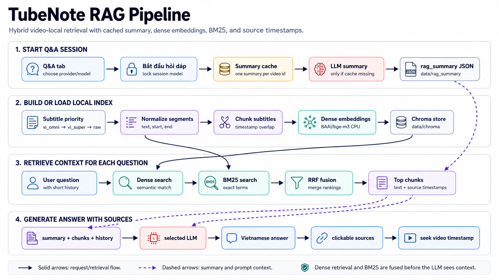

# RAG Pipeline

TubeNote provides video-local question answering over processed subtitles. The
goal is to answer in Vietnamese with clickable source ranges from the video.

## Pipeline Diagram



## User Flow

On the video page:

```text
open Q&A tab
-> choose provider/model
-> click "Bắt đầu hỏi đáp"
-> TubeNote creates or loads a cached video summary
-> provider/model is locked for the current chat session
-> user asks follow-up questions
```

The summary is generated once per video. If `data/rag_summary/{video_id}.json`
already exists, TubeNote loads it even if the user selects a different chat
model later. The selected model still controls answer generation for the current
chat session.

## Subtitle Source

RAG loads the shared local subtitle file:

```text
data/subtitles/{video_id}.json
```

Before dubbing, this file contains raw source subtitles. After dubbing, the same
file also contains `text_vi`, `text_tts`, and TTS timing metadata. RAG prefers
`text_vi`, then `text_tts`, then raw `text`.

## Segment Normalization

Subtitle JSON can come from different stages, so the RAG loader normalizes each
segment into:

```json
{
  "text": "best available subtitle text",
  "start": 12.4,
  "end": 16.6
}
```

For translated subtitles, `text_vi` is preferred. For raw subtitles, source
`text` is used.

## Indexing

Indexing runs when a video is first asked about or when the vector store is
missing/stale.

```text
subtitle segments
  -> timestamp-aware chunks with overlap
  -> dense embeddings
  -> Chroma vector store
  -> BM25 corpus over the same chunks
```

Current dense embedding default:

```text
provider: huggingface
model: BAAI/bge-m3
device: cpu
normalize: true
```

Embedding runs on CPU by default so it does not compete with Whisper/TTS GPU
memory. If the embedding model changes, delete `data/chroma/` because vector
dimensions and embedding space change.

## Chunking

RAG chunks are subtitle-aware:

- They keep source timestamp ranges.
- They preserve segment order.
- They use overlap so a concept split across neighboring subtitles can still be
  retrieved.

Each chunk stores metadata such as:

```text
video_id
start
end
source
segment_start
segment_end
embedding_model
rag_version
```

The frontend uses `start` and `end` to show clickable source ranges.

## Hybrid Retrieval

Each question uses two retrieval paths:

```text
question
  -> dense search in Chroma
  -> sparse BM25 search over all chunks
  -> Reciprocal Rank Fusion
  -> final top chunks sent to the LLM
```

Dense retrieval helps with semantic matches. BM25 helps with exact technical
terms, acronyms, names, and short phrases. Reciprocal Rank Fusion combines both
rankings without relying on raw score scales being directly comparable.

Key settings live in `backend/config.yaml`:

```text
rag.similarity_threshold
rag.fetch_k
rag.final_k
rag.fallback_k
```

## Summary Cache

The summary route:

```text
GET /api/rag/video/{video_id}/summary?provider=...&model=...
```

Behavior:

```text
if data/rag_summary/{video_id}.json exists:
  return cached summary
else:
  load local subtitles
  summarize with selected provider/model
  save data/rag_summary/{video_id}.json
  return summary
```

The cache is intentionally keyed by video id only. This avoids paying for a new
summary every time the user changes the answer model.

The summary is used as stable background context for broad questions such as:

- "Tóm tắt nội dung video"
- "Video này dạy gì?"
- "Các ý chính là gì?"

## Chat History

The frontend sends a short recent history window with each question:

```text
User: previous question
Assistant: previous answer
User: current question
```

Only recent user/assistant text is sent. Retrieved chunks from older questions
are not stored separately. This keeps the implementation simple while allowing
basic follow-up questions.

## Prompt Construction

The Q&A prompt is assembled in this order:

```text
system rules
video summary
retrieved subtitle chunks
recent chat history
current question
```

The system rules ask the model to:

- Answer in Vietnamese.
- Prefer video-local evidence.
- Cite source ranges when useful.
- Avoid fabricating details not present in retrieved context.
- Use the summary for broad questions and retrieved chunks for specific ones.

## Provider/Model Selection

The frontend obtains available RAG models from:

```text
GET /api/rag/models
```

Model lists are defined in `backend/config.yaml`. Current provider families:

- DeepSeek
- Gemini
- OpenAI
- Anthropic

After `Bắt đầu hỏi đáp`, the provider/model is locked for that chat session.
Changing model resets the summary display and chat messages in the UI, then the
user starts a new session.

## Web Search

The current default Q&A path is video-local. SearXNG support exists as an
optional service, but video Q&A is designed to work without it.

When enabled and wired into a mode that uses it, web search should be treated as
supplemental context, not a replacement for video-local subtitle evidence.

## Output Shape

The backend returns:

```json
{
  "answer": "Vietnamese answer",
  "sources": [
    {
      "start": 12.4,
      "end": 16.6,
      "text": "subtitle chunk text",
      "source": "subtitles"
    }
  ],
  "top_rag_score": 0.72,
  "cache_usage": {}
}
```

The frontend displays the answer and up to several source ranges. Clicking a
source seeks the video to that timestamp.

## Limitations

- RAG quality depends on subtitle quality and chunk boundaries.
- If a video has not been dubbed, RAG may answer from raw English subtitles.
- Summary is cached per video, not per model.
- Chat history is short and not persisted to disk.
- The vector store is local and should be rebuilt after embedding-model changes.

## Useful Debug Paths

```text
data/chroma/                  Chroma persistent stores
data/rag_summary/{id}.json    Cached summary
data/subtitles/{id}.json      Raw/enriched subtitle JSON
```
